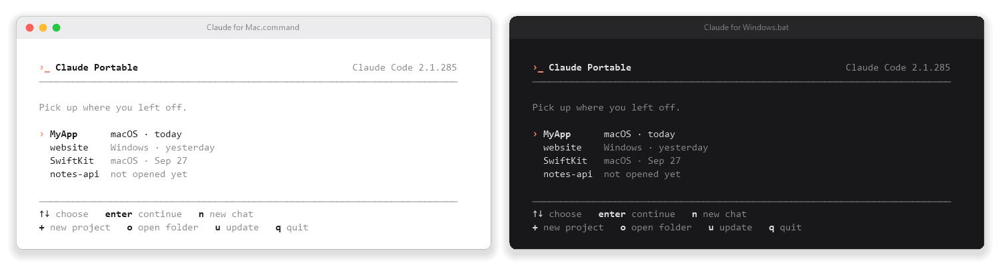

<p align="center">
  
</p>

<h1 align="center">Claude Portable</h1>

<p align="center">
  Claude Code on a USB drive. One memory, one set of conversations, on every computer you plug it into,<br>
  so switching from Windows to your Mac doesn't mean starting over.
</p>

<p align="center">
  <a href="https://github.com/liwidale/claude-portable/releases/latest"></a>
  <a href="https://github.com/liwidale/claude-portable/actions/workflows/ci.yml"></a>
  
  <a href="LICENSE"></a>
</p>

<p align="center">
  
</p>

<p align="center"><sub>The menu on both systems, drawn from the scripts' real output.</sub></p>

## Contents

- [Installation](#installation)
- [What you get](#what-you-get)
- [Everyday use](#everyday-use)
- [Switching computers](#switching-computers)
- [Projects that aren't on the drive](#projects-that-arent-on-the-drive)
- [Bringing your existing history](#bringing-your-existing-history)
- [Command line](#command-line)
- [Where everything is kept](#where-everything-is-kept)
- [Privacy and security](#privacy-and-security)
- [Troubleshooting](#troubleshooting)
- [How it works](#how-it-works)
- [Limitations](#limitations)
- [Project structure](#project-structure)
- [Development](#development)
- [Contributing](#contributing)
- [License](#license)

## Installation

**In short:** format a USB drive as exFAT, unzip the [latest release](https://github.com/liwidale/claude-portable/releases/latest) onto it, double-click the script for your computer and let it download Claude Code. The steps below walk through each part.

### What you need

- A USB drive with about **1 GB** free. A fast USB 3 drive makes Claude Code start noticeably quicker.
- **Windows 10 or 11** (64-bit) and/or **macOS 11 Big Sur or later** (Apple silicon or Intel). Linux works too, see [below](#on-linux).
- An internet connection the first time, to download Claude Code.
- A **Claude subscription** (Pro, Max, Team or Enterprise) or an **Anthropic API key**, the same as for Claude Code itself.

### 1. Prepare the drive

The drive has to be **exFAT**, the one file system that both Windows and macOS read and write out of the box. If it already is, skip this step. Formatting erases everything on the drive.

**On Windows**

1. Open **File Explorer** and find the drive under **This PC**.
2. Right-click it and choose **Format…**.
3. Set **File system** to **exFAT**, give it a name like `Claude`, keep **Quick Format** ticked and click **Start**.

**On a Mac**

1. Open **Disk Utility** (in **Applications -> Utilities**).
2. Choose **View -> Show All Devices**, then select the drive itself in the sidebar (the top-level device, not the volume under it).
3. Click **Erase**. Set **Format** to **ExFAT** and **Scheme** to **Master Boot Record**, give it a name like `Claude` and click **Erase**.

### 2. Put Claude Portable on it

1. Go to the [latest release](https://github.com/liwidale/claude-portable/releases/latest) and download `claude-portable-<version>.zip`.
2. **On Windows**, right-click the ZIP first, choose **Properties**, tick **Unblock** and click **OK**. Without that, Windows asks for confirmation every time you run the script.
3. Unzip it and copy the **ClaudePortable** folder onto the drive.

The drive now looks like this:

```
Claude/
└── ClaudePortable/
    ├── Claude for Mac.command
    ├── Claude for Windows.bat
    ├── LICENSE
    ├── README.md
    └── system/
```

### 3. Open it the first time

**On Windows**, double-click `Claude for Windows.bat`. If Windows shows **Windows protected your PC**, click **More info**, then **Run anyway**.

**On a Mac**, double-click `Claude for Mac.command`. Because the script came from the internet, macOS asks once:

- If it says the file **can't be opened**, right-click it and choose **Open**. On macOS 15 and later, open **System Settings -> Privacy & Security** instead, scroll down and click **Open Anyway**.
- If macOS asks whether Terminal may access files on a removable volume, click **Allow**.

Either way, Claude Portable notices that Claude Code isn't on the drive yet and offers to download it. Press **Enter**. It downloads Anthropic's official builds for Windows, Apple silicon Macs and Intel Macs, about 700 MB in total, straight from `downloads.claude.ai`, and checks each file against Anthropic's published SHA-256 before saving it. This happens once: after that, the drive works on any of those computers without downloading anything.

### 4. Sign in

Pick a project in the menu, or press `+` to create one, and press **Enter**. The first time on each computer, Claude Code walks you through choosing a colour theme and signing in with your Claude account or API key. From then on it opens straight into your conversation.

That's it. See [Everyday use](#everyday-use) for the menu, and [Switching computers](#switching-computers) for moving between machines.

### Updating

- **Claude Code:** press `u` in the menu. It downloads the newest version for both systems if there is one.
- **Claude Portable:** download the new release and copy the contents of its **ClaudePortable** folder over the one on the drive, replacing files when asked. Your conversations, projects and Claude Code live in `data`, `Projects` and `bin`, which the release doesn't contain, so nothing of yours is touched.

### Installing from source

Instead of the release ZIP, you can clone the repository straight onto the drive:

```bash
git clone https://github.com/liwidale/claude-portable.git /Volumes/Claude/ClaudePortable
```

On Windows, use the drive letter instead, for example `E:\ClaudePortable`. A clone works exactly like the release; it just also contains the tests and CI files, and it doesn't hide the support folders.

### On Linux

There is no double-click script, but the launcher and its menu work the same:

```bash
cd /media/$USER/Claude/ClaudePortable
./system/setup.sh linux-x64        # or linux-arm64; add "all" to get the Windows and Mac builds too
./system/claude-portable.sh
```

### Uninstalling

Delete the **ClaudePortable** folder from the drive. Everything Claude Portable stores is in that folder. The one exception is a Mac, where Claude Code keeps your sign-in in the Keychain: to remove it, open **Keychain Access** and delete the entries named **Claude Code**.

## What you get

- **The same conversation on every computer.** Continue exactly where you stopped, with the whole history, on Windows, macOS or Linux.
- **Claude knows where it is.** Every launch tells Claude which computer it's on, where the project lives there, which toolchains are installed, and where the project lived on the other machines. It maps old paths to new ones instead of trying to open `E:\MyApp` on a Mac.
- **One double-click, one key.** The menu lists your projects with the computer and day each was last used. The one you used last is already selected, so Enter takes you back into your conversation.
- **Memory that travels.** Claude Code's auto memory, your custom `/commands`, settings and prompt history all live on the drive, not in the computer's home folder.
- **A handoff note in one command.** Before you leave, `/handoff` makes Claude write down what's done, what's next and what has to happen on the other machine. Every future session of that project starts with it, even a brand-new one.
- **A tidy drive.** You see two scripts, your `Projects` folder and this README. On a removable drive, Claude Portable hides its support folders, on both systems.
- **One version everywhere.** Claude Code's auto-update is off, so both machines run the same version until you press `u` in the menu.

## Everyday use

Double-click `Claude for Windows.bat` or `Claude for Mac.command`, and pick a project:

| Key | What it does |
| --- | --- |
| `↑` `↓` | Choose a project. `j` and `k` work too. |
| `Enter` | Open it and continue the last conversation. |
| `n` | Open it with a new conversation. |
| `+` | Create a project in `Projects` on the drive and open it. |
| `o` | Open a folder on this computer. Type its path or drag the folder into the window. It stays in the list from then on. |
| `u` | Download a newer Claude Code for both systems, if there is one. |
| `q` | Quit. `Esc` works too. |

Claude opens in the same window, titled with the project's name. When you're done, leave Claude with `/exit` and close the window before you eject the drive: Claude Code writes the conversation to disk as it goes.

## Switching computers

1. In Claude, run `/handoff`. Add anything it should keep in mind: `/handoff remember to test on iOS 17`.
2. Type `/exit`, close the window and eject the drive.
3. On the other computer, double-click its script and press **Enter**.

`/handoff` is optional. Without it, the conversation still continues with its full history; the note just gives Claude a short summary to start from.

## Projects that aren't on the drive

A project doesn't have to live on the drive. If you keep a clone on each computer, for example `C:\dev\MyApp` and `~/dev/MyApp`, open it with `o` on each. Claude Portable matches projects **by folder name**, so give the folder the same name on both machines, or open it from the command line with the same `--name` everywhere.

This is the faster option for Xcode projects, since builds run from the computer's SSD instead of the drive.

## Bringing your existing history

Already using Claude Code on this computer? Copy a project's conversations and memory onto the drive:

```bash
./system/claude-portable.sh --import ~/dev/MyApp
```

On Windows: `system\claude-portable.ps1 --import C:\dev\MyApp`. From then on, those conversations continue wherever you open a project with that name.

## Command line

Everything the menu does is also available from a terminal, and on Linux it's the way to start Claude Portable.

```bash
./system/claude-portable.sh [PROJECT_DIR] [--new | --continue | --resume] [--name NAME] [-- CLAUDE_ARGS...]
./system/claude-portable.sh --import DIR [--name NAME]
./system/setup.sh [all | PLATFORM...] [--version stable | latest | X.Y.Z]
```

On Windows, run `system\claude-portable.ps1` and `system\setup.ps1` with the same arguments.

| Option | What it does |
| --- | --- |
| `PROJECT_DIR` | Open this folder. Without it you get the menu. |
| `--new` | Start a new conversation. |
| `--continue` | Continue the most recent conversation. This is the default when one exists. |
| `--resume` | Pick a conversation from a list. |
| `--name NAME` | Name used to match this project across computers. Defaults to the folder name. |
| `--import DIR` | Copy this computer's existing Claude Code history for `DIR` onto the drive. |
| `--` | Pass everything after it to `claude`, for example `-- --verbose`. |

Set `CLAUDE_PORTABLE_BIN` to use a different `claude` executable instead of the one on the drive, and `NO_COLOR` to turn colours off.

## Where everything is kept

| What | Where |
| --- | --- |
| Your projects, if you keep them on the drive | `Projects/` |
| Claude Code itself | `bin/<platform>/` |
| Conversations, memory, settings, `/commands` | `data/`, which Claude Code uses as its config folder (`CLAUDE_CONFIG_DIR`) |
| Every path a project has had on each computer | `data/portable/projects/<project>.tsv` |
| Handoff notes | `data/portable/handoff/<project>.md` |
| What Claude is told about the current computer | `data/portable/run/<project>.md` |
| The launcher and setup scripts | `system/` |

On a removable drive, `bin`, `data` and `system` are hidden. To see them, press `⌘⇧.` in Finder, or turn on **Hidden items** in File Explorer's **View** menu.

## Privacy and security

- **Your sign-in is on the drive on Windows and Linux.** Claude Code keeps its sign-in token in its config folder there, which here is `data/` on the drive. If you lose the drive, sign out of your sessions in your Claude account settings. On macOS the token goes to the Keychain of each Mac and never touches the drive.
- **No telemetry.** Claude Portable has no telemetry and no servers of its own. The only thing it downloads is Claude Code, from `downloads.claude.ai`. Claude Code talks to Anthropic as it always does.
- **Your conversations stay on the drive.** They're written to the drive, not to the home folder of each computer you use. The only thing a Mac keeps is your sign-in, in its Keychain.
- **Encrypt the drive if it holds anything sensitive.** [VeraCrypt](https://veracrypt.io) works on both Windows and macOS.

## Troubleshooting

**macOS won't open `Claude for Mac.command`.**
Right-click it and choose **Open**; on macOS 15 and later, click **Open Anyway** in **System Settings -> Privacy & Security** instead. Or run `bash "/Volumes/YourDrive/ClaudePortable/Claude for Mac.command"` in Terminal. Allow Terminal to access removable volumes when macOS asks.

**Windows asks whether to run the file.**
Files unzipped from a download carry a "came from the internet" mark. Choose **Run**, or clear the mark once: right-click the ZIP before unzipping, **Properties -> Unblock**.

**Question marks instead of letters in the Windows console.**
Old console windows sometimes use a raster font that has no glyphs beyond basic Latin. Claude Portable switches such windows to Consolas automatically. If you still see `???`, start the script from Windows Terminal.

**The conversation didn't continue on the other computer.**
Check that the project folder has the same name on both machines. Also check that Claude had exited on the first computer before the drive was ejected.

**Something else.**
Please [open an issue](https://github.com/liwidale/claude-portable/issues). Include your OS, the Claude Code version from the top of the menu and what the window printed.

## How it works

```
                 USB drive
                 ┌────────────────────────────────────────────────┐
Windows  E:\ ──▶ │  launcher ──▶ data/projects/E--…-MyApp/        │
                 │      │             ▲  sync newest              │
                 │      │             ▼                           │
macOS /Volumes ─▶│      └──▶ data/projects/-Volumes-…-MyApp/      │
                 │                                                │
                 │  data/portable/projects/MyApp.tsv   all paths  │
                 │  data/portable/run/MyApp.md          context   │
                 └────────────────────────────────────────────────┘
```

1. **The two scripts are thin.** `Claude for Windows.bat` and `Claude for Mac.command` start the launcher, `system/claude-portable.ps1` or `system/claude-portable.sh`, which shows the menu and does the actual work the same way on every system.
2. **Claude Code runs from the drive.** The launcher starts the copy of Claude Code in `bin/` with `CLAUDE_CONFIG_DIR` pointed at `data/`, so everything it stores lands on the drive.
3. **Bridging paths.** Claude Code files conversations under the project's absolute path, so `E:\ClaudePortable\Projects\MyApp` and `/Volumes/USB/ClaudePortable/Projects/MyApp` look like two unrelated projects to it. The launcher records every path a project has had, on every computer, and before each launch copies newer conversations and memory from all of them into the folder for the current path. Conversation files are append-only, so the longer file always wins, whatever the two computers' clocks say. Nothing is ever deleted.
4. **Telling Claude where it is.** Each launch writes a short briefing: this computer, the project path here, the installed toolchains, the project's paths elsewhere and the latest handoff note. It goes to Claude through `--append-system-prompt-file`. The launcher also passes `--system-prompt-snapshot off`, because otherwise Claude Code would replay the system prompt recorded on the first computer, OS and working directory included, every time the conversation is resumed.
5. **Matching Claude Code exactly.** The launcher computes the folder name the way Claude Code does, from the real on-disk path. On Windows that means long names instead of 8.3 short names like `PROGRA~1`. If Claude Code ever stores a session somewhere else anyway, for example with symlinks or very long paths, the launcher notices after the session ends and uses that folder from then on.

## Limitations

- **This is Claude Code in a terminal, not the Claude desktop app.** The desktop app is installed into the system and keeps its data in your user profile, so it can't run from a drive. The agent is the same.
- **One computer at a time.** Claude Portable is built around a single drive moving between machines. If you sync `data/` through a cloud folder instead and use two computers at once, one computer's changes to a conversation can overwrite the other's.
- **Linux has no double-click script.** Run `system/claude-portable.sh`; it shows the same menu. Get Claude Code with `system/setup.sh linux-x64` (or `linux-arm64`).

## Project structure

```
Claude for Windows.bat     Claude for Mac.command      double-click to start
system/
  claude-portable.ps1      launcher and menu for Windows (Windows PowerShell 5.1 or later)
  claude-portable.sh       launcher and menu for macOS and Linux (bash 3.2 or later)
  setup.ps1, setup.sh      download Claude Code and verify its checksums
  console.ps1              UTF-8, colours and font setup for Windows consoles
  template/                copied into data/ on first run: settings, /handoff
tests/                     end-to-end tests with a fake Claude Code
bin/, data/, Projects/     created on the drive, never committed
```

## Development

The two launchers have the same features and the same end-to-end test. The test runs the real launcher against a fake Claude Code that stores sessions the way Claude Code does, and moves the drive folder to another parent directory to stand in for another computer. It drives the menu too: `CLAUDE_PORTABLE_KEYS` replays key presses (`"down n"`, `"+ text=Notes"`) instead of reading the keyboard.

```bash
bash tests/smoke.sh                                                  # macOS, Linux
powershell -NoProfile -ExecutionPolicy Bypass -File tests\smoke.ps1  # Windows
```

`FORCE_COLOR=1` keeps the colours when the output isn't a terminal, which is how the picture at the top is made from the real output. CI runs the tests on macOS with the stock bash 3.2, on Linux, and on Windows with Windows PowerShell 5.1, and lints the scripts with ShellCheck and PSScriptAnalyzer. Pushing a tag like `v1.0.0` builds the release ZIP with `git archive` and publishes it.

## Contributing

Issues and pull requests are welcome.

- Keep the two launchers in step: a change to `claude-portable.sh` needs the same change in `claude-portable.ps1`, and a test in both `tests/smoke.sh` and `tests/smoke.ps1`.
- The scripts must run on what every computer already has: bash 3.2 and the BSD tools on macOS, Windows PowerShell 5.1 on Windows. No jq, no Python, no PowerShell 7.
- Save `.ps1` files as UTF-8 with a BOM. Windows PowerShell 5.1 reads them in the ANSI code page otherwise.
- Run both test suites and ShellCheck before opening a pull request.

## License

[MIT](LICENSE) © 2026 Liwidale

Claude Portable is an independent community project. It is not made by, affiliated with or endorsed by Anthropic. Claude and Claude Code are trademarks of Anthropic. Claude Code itself is not part of this repository: the scripts download Anthropic's official builds, which are covered by [Anthropic's terms](https://www.anthropic.com/legal/consumer-terms).
